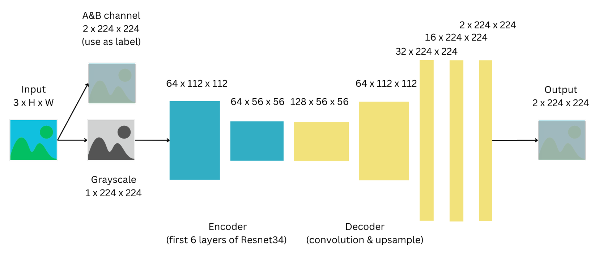

# Grayscale Image Colorization with Deep Learning

This project focuses on colorizing grayscale images using deep learning techniques. The goal is to convert black and white images into colorized versions while preserving the original content and maintaining realism in the colors used. This task has applications in various domains, including photography, cinematography, medical imaging, and more.

## Table of Contents

- [Introduction](#introduction)
- [Dataset](#dataset)
- [Model Architecture](#model-architecture)
- [Training Procedure](#training-procedure)
- [Evaluation](#evaluation)
- [Results and Limitations](#results-and-limitations)
- [Future Work](#future-work)
- [Getting Started](#getting-started)

## Introduction

Grayscale image colorization is a challenging problem in computer vision. This project employs Convolutional Neural Networks (CNNs) to solve this problem. The primary motivation for grayscale image colorization is to enhance the visual quality of images and improve understanding, making it useful in various fields such as historical image restoration, medical imaging, and art creation.

### Related Work

Previous approaches to image colorization involved manual efforts or automated methods such as histogram matching, color transfer, and neural networks. Deep learning-based approaches have shown promising results, including architectures like VGG-16 and GAN-based methods. These approaches have paved the way for efficient and realistic colorization of grayscale images.

## Dataset

The model is trained on the ImageNet dataset, which is known for its high-quality images and diverse content. ImageNet contains millions of images across different object categories, making it suitable for training deep learning models. Grayscale images are colorized using the color information from the same dataset, which is essential for training the model.

### Pre-processing & Augmentation

Before training, several pre-processing steps are applied to the dataset:

- Conversion of grayscale images to RGB format.
- Resizing images to 224x224 pixels.
- Conversion from RGB to LAB color space.
- Normalization of LAB values to the range of 0 to 1.
- Separation of the "ab" channels for training.

## Model Architecture

The chosen architecture for this task is a modified version of the ResNet-34 model, followed by a decoder network. The ResNet-34 model is known for its strong performance in computer vision tasks. In this implementation, the model is adapted to accept grayscale images as input and produce colorized outputs.

The model architecture includes:

- Encoder network (first 6 layers of ResNet-34).
- Decoder network with convolutional layers, batch normalization, and ReLU activation.
- Upsampling layers to increase spatial resolution.
- Final layer producing two-channel images for the "a" and "b" channels of the LAB color space.

## Training Procedure

The training process involves the following steps:

- Data loading and augmentation.
- Model initialization.
- Hyperparameter setting (e.g., learning rate, batch size).
- Splitting the dataset into training and validation sets.
- Training the model with an early stopping mechanism.
- Optimizer: Adam optimizer.
- Loss function: Mean Squared Error (MSE).

## Evaluation

The model's performance is evaluated on both quantitative and qualitative metrics:

- Quantitative Metrics:
  - Mean Squared Error (MSE) between predicted and actual "ab" values in LAB color space.

- Qualitative Metrics:
  - Visual comparison of colorized images with ground truth images.
  - Human perception evaluation for realism.

## Results and Limitations

The project demonstrates the potential of deep learning for grayscale image colorization. The model produces realistic and visually appealing results, particularly for nature scenes and animals. However, it has limitations:

- Difficulty in capturing small details in complex or blurred backgrounds.
- Poor performance with images of people and indoor scenes.

## Future Work

Future research directions and improvements include:

- Incorporating attention mechanisms to capture fine details.
- Developing specialized models for specific image categories.
- Exploring perceptual metrics (e.g., SSIM, PSNR) for evaluation.
- Expanding the training dataset for better generalization.

## Getting Started

To run the code and experiment with grayscale image colorization, follow these steps:

1. Clone this repository.

2. Install the required Python libraries using `pip install -r requirements.txt`.

3. Download the ImageNet dataset or use your custom dataset for training.

4. Modify the dataset paths and hyperparameters in the code to suit your needs.

5. Train the model and evaluate its performance.

